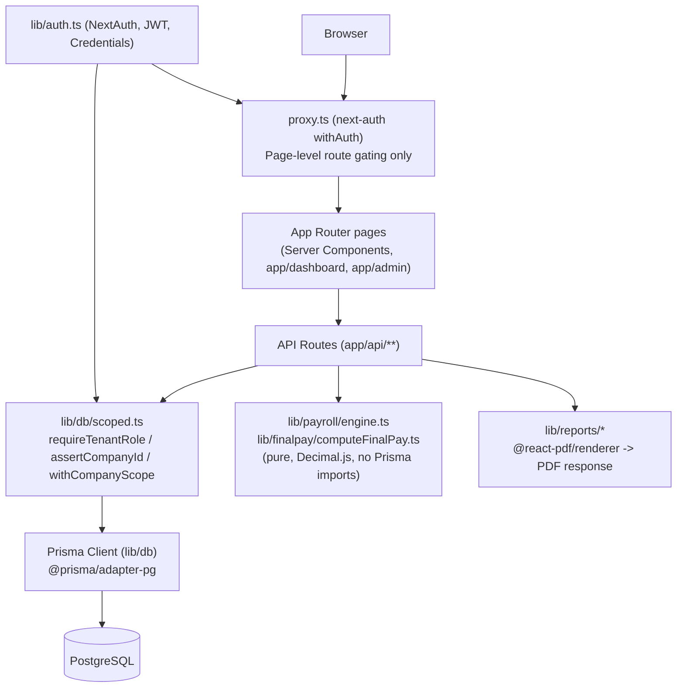

# ANTIGRAVITY PROJECT HANDOVER

**Audited:** 2026-08-10, at commit `7692b6d` on branch `main` (clean working tree, single branch, no open PRs). Repo: `https://github.com/snaken123/PH_Payroll`.

## Project name

PH_Payroll (`package.json` name: `ph-payroll`)

## Project purpose

A Philippine payroll SaaS for small/medium businesses. Multi-tenant (each `Company` is a tenant), semi-monthly cutoff payroll, with modules for employee records, attendance, leave, loans/cash advances, government-mandated statutory deductions (SSS, PhilHealth, Pag-IBIG, BIR withholding tax), 13th month pay, final pay/separation settlement, an independent contractor-payment track (expanded withholding tax), and a set of downloadable PDF government/payroll reports.

## Current development status

Functionally broad and structurally disciplined — far more complete than a typical MVP. Core payroll math is unit-tested with golden values, the multi-tenant isolation model is consistently applied, and the codebase is unusually well self-documented (comments routinely cite the specific Labor Code article, BIR issuance, or SSS circular behind a rule, and explicitly flag their own simplifications inline). However, it has **never been used for a real payroll run against verified government rate tables** — the seeded SSS bracket data is explicitly marked by its own author-comment as unverified against the official circular, and there is **no way to update any statutory rate table through the application itself** (see "Biggest known risks" below). Treat this as a strong engineering foundation that is not yet production-accurate for real government remittances.

## Technology stack (one line each — full detail in §2)

Next.js 16.2.10 (App Router) · React 19.2.4 · TypeScript 5 · Prisma 7.8.0 (`@prisma/adapter-pg` driver adapter) · PostgreSQL · NextAuth 4.24.14 (JWT, Credentials-only) · Tailwind CSS 4 + shadcn-style components on `@base-ui/react` · react-hook-form + Zod 4 · Decimal.js · `@react-pdf/renderer` · Vitest · deployed on Vercel.

## Overall health assessment

- **Payroll math core:** solid. Pure, database-free, Decimal.js-based, golden-value tested (96/96 tests passing across 18 files). Every simplification is documented inline by the original author, not hidden.
- **Multi-tenant isolation:** solid, consistently applied 3-layer pattern (see §11).
- **Type/lint health:** `tsc --noEmit` is clean. ESLint reports 6 errors / 3 warnings, all non-blocking (React Compiler flagging `setState`-in-`useEffect` patterns in 4 components, 2 unescaped-apostrophe JSX errors, 1 unused import). None of these were runtime bugs in prior manual testing this session's history describes.
- **Statutory rate governance:** **weak** — this is the single biggest gap. See "Biggest known risks."
- **Operational maturity:** no CI/CD, no `.env.example`, no staging environment, single `main` branch with direct-push workflow (by explicit user choice, not an oversight — see §15).

## Most important unfinished work

1. **No admin UI or API exists to create, update, or version any statutory rate table** (SSS, PhilHealth, Pag-IBIG, BIR withholding, 13th-month exemption ceiling, de minimis ceilings, minimum wage). The schema's own comment calls these "SUPER_ADMIN-editable," but no code path does that — only `prisma/seed.ts`, a script, populates them. `app/admin` only has Companies and Employees pages.
2. **BIR Form 2316 / year-end annualization does not exclude non-taxable allowances or apply the ₱90,000 combined 13th-month/other-benefits exemption ceiling** from taxable income before computing the year-end tax true-up — flagged explicitly in the document's own on-page notice and in `lib/reports/queries.ts`, but never actually fixed despite a code comment elsewhere claiming this was "deferred to the Phase 4 annualization engine" — the Phase 4 engine (`lib/payroll/annualization.ts`) now exists and still doesn't close this gap. **This is a real conflict between an old planning comment and current code — treat the code as authoritative: the gap is still open.**
3. **`DeMinimisCeiling` is modeled and seeded but never read by any application code.** The payroll engine's tax computation only checks an allowance's `isTaxable` boolean; the `isDeMinimis`/`deMinimisCategory` fields on `AllowanceLine` are defined in the schema and seed data references the ceiling table, but nothing in the engine ever caps a "non-taxable" allowance against its de minimis ceiling. In practice, an admin marking any allowance `isTaxable: false` currently gets it fully excluded from tax with no ceiling enforcement at all — more generous to the employee than the law actually allows above the ceiling.

## Biggest known risks

- **Unverified statutory rate data.** `prisma/seed.ts`'s own comment on `generateSssBrackets()`: *"SSS's own compensation-range-to-MSC PDF table is a scanned image and could not be transcribed from a primary source... VERIFY the exact compensation-range boundaries against the official SSS circular before this seed is used for real payroll."* Rate/split/floor/ceiling parameters are claimed as confirmed; the exact bracket boundaries are programmatically generated, not transcribed. **Do not treat current SSS numbers as production-accurate until independently verified.**
- **Live default credential still seeded.** `prisma/seed.ts` upserts a `SUPER_ADMIN` user `admin@ph-payroll.local` with password `ChangeMe123!` on every seed run. This is a known, previously-disclosed exposure on the production database from earlier work on this project and, as of this audit, **still not confirmed rotated.** Treat as an open, live security item, not hypothetical.
- **No rate-table admin surface** (see "Most important unfinished work" #1) — this blocks the product from ever being correctly maintained past whatever was seeded once, without direct database/Prisma Studio access.

## Recommended immediate next step

See "FIRST TASK FOR ANTIGRAVITY" below — do not start there without reading it first.

---

## FIRST TASK FOR ANTIGRAVITY

**Do not write code yet.** The single most valuable first action is to **verify the seeded SSS, PhilHealth, Pag-IBIG, and BIR withholding bracket data against current primary-source government issuances**, and report back a list of confirmed-correct vs. suspect rows, before anything else touches the payroll engine.

**Why this first, and not the missing rate-admin UI (which is arguably the "real" biggest gap):** building an admin UI to edit rate tables that are themselves unverified just makes it easier to confidently ship wrong numbers. Verifying the data is cheap (no code changes, no risk of regressing the passing test suite) and is the prerequisite that determines whether the rate-admin UI work in Phase 0/1 is "add a UI over correct data" or "fix the data, then add a UI." It also directly de-risks the single biggest thing that could make this product legally wrong in production: incorrect statutory withholding.

Once that's done, the two next-highest-value items are (a) building the rate-table admin UI (§18 Phase 0/1), and (b) closing the Form 2316 taxable-income exclusion gap (§18 Phase 2) — both are scoped in the roadmap below.

---

# 1. Repository audit scope

This document is based on direct inspection of: `package.json`, lock file presence, `prisma/schema.prisma` (full, 987 lines), `prisma/seed.ts`, `prisma/migrations/` (2 migrations), every file under `lib/payroll/**`, `lib/finalpay/**`, `lib/contractors/**`, `lib/services/**`, `lib/reports/queries.ts` + `logDocument.ts`, `lib/auth.ts`, `lib/db/scoped.ts`, `lib/env.ts`, `proxy.ts`, every API route under `app/api/**` (directory listing + representative reads of payroll-run/final-pay/loan/report endpoints), `app/admin/**`, `components/dashboard-nav.tsx`, `AGENTS.md`/`CLAUDE.md`/`.claude/launch.json`, `README.md`, `.gitignore`, `next.config.ts`, `prisma.config.ts`, `.vercel/project.json`, `vitest.config.ts`, and full-repo greps for TODO/FIXME/HACK/console.log/hardcoded/placeholder/"KNOWN SIMPLIFICATION"/Phase markers. `tsc --noEmit`, `eslint .`, and `vitest run` were executed live against the current tree. Documentation (`README.md`) was found to be **generic create-next-app boilerplate, not describing this application at all** — it was not treated as a source of truth; source code was.

---

# 2. Actual technology stack

| Technology | Version | Role |
|---|---|---|
| Next.js | 16.2.10 | App Router, full stack (pages + API routes). No `middleware.ts` — routing/session gating is in `proxy.ts` at the repo root using `next-auth/middleware`'s `withAuth`, which is functionally the same role. |
| React | 19.2.4 | UI. Some components hit the React Compiler's stricter lint rules (see §9). |
| TypeScript | ^5 | Strict-enough to compile clean (`tsc --noEmit` = 0 errors) across the whole repo. |
| Prisma | 7.8.0, `@prisma/adapter-pg` | ORM, using the newer driver-adapter pattern (not the legacy binary engine) against `pg` directly. Generated client output is customized to `lib/generated/prisma` (not `node_modules/.prisma`). |
| PostgreSQL | — | Database. Hosting: `.vercel/project.json` confirms a linked Vercel project (`ph-payroll`); actual DB host was not re-verified this session — prior work in this project established it as Neon-hosted Postgres. `NEEDS VERIFICATION` if relied upon without re-pulling `.env`. |
| NextAuth | 4.24.14 | Auth. **Credentials provider only** — no OAuth/SSO configured. JWT session strategy; the JWT itself carries `companyId`/`companyRole`/`platformRole`, re-derived from the DB on every `jwt` callback invocation (not just at login) so role/membership changes take effect on next request, not just next login. |
| bcryptjs | ^3 | Password hashing for the Credentials provider. |
| `@base-ui/react` + shadcn conventions | ^1.6 | Component primitives (`components.json` present). Not Radix — `@base-ui/react`'s API differs in places (e.g. `Select`'s `onValueChange` signature is `(value: string \| null, eventDetails) => void`). |
| Tailwind CSS | ^4 | Styling, via `@tailwindcss/postcss`. |
| react-hook-form + `@hookform/resolvers` + Zod 4 | — | Forms and validation, used consistently across every create/edit dialog and every API route's input schema (`lib/validations/*.ts`). |
| Decimal.js | ^10.6 | All money/rate arithmetic — no native floating point is used for payroll math anywhere in `lib/payroll`, `lib/finalpay`, `lib/contractors`. |
| `@react-pdf/renderer` | ^4.5 | Server-side PDF generation for all 10 report/document types (§7, §16). |
| `@vercel/blob` | ^2.5 | **Installed, dependency present, but zero usages found anywhere in `app/`, `lib/`, or `components/`.** Dead dependency — no file-upload/storage feature is actually implemented. |
| `date-fns`, `next-themes`, `sonner`, `lucide-react`, `tw-animate-css` | — | Date formatting, dark-mode toggle, toast notifications, icons, animation utility respectively. All in active use. |
| Vitest 4 (+ `@vitest/ui`) | — | Test runner. 18 test files, all under `__tests__/` folders colocated with the code they test, all in `lib/payroll`, `lib/finalpay`, `lib/contractors` (pure business logic only — **no component tests, no API route tests, no E2E tests exist**). |
| ESLint 9 (flat config) + `eslint-config-next` | — | Linting; see §9 for current findings. |
| Vercel | — | Hosting/deployment target (project linked; no `vercel.json` — configuration is Vercel's Next.js auto-detection defaults). |

No state-management library (Redux/Zustand/etc.) — state is React local state + server-fetched data, consistent with the App Router's server-component-first model. No email service, no SMS service, no file storage service, no payment/billing integration are wired up anywhere in the code, despite `@vercel/blob` being installed.

---

# 3. Understanding the application

### Target users / businesses
Philippine small-to-medium employers running their own in-house payroll (the `Company` model is the tenant unit), potentially including bookkeeping firms managing several client companies under one login (`CompanyMembership` explicitly supports a user belonging to multiple companies with independent roles — this exact scenario is named in a schema comment).

### User roles
- **Platform level** (`PlatformRole`): `STANDARD` | `SUPER_ADMIN`. Super admins operate `/admin` (tenant/company provisioning, cross-tenant employee directory) and can switch their active session into any company.
- **Company level** (`CompanyRole`, per-membership): `COMPANY_OWNER`, `PAYROLL_ADMIN`, `HR_STAFF`, `APPROVER`, `EMPLOYEE_SELF`. Role gating is enforced per-API-route (§11), with a consistent "segregation of duties" pattern for payroll (whoever computes a run need not be the one who approves it — see `app/api/payroll/runs/[id]/approve/route.ts`'s own comment).

### Core business processes (IMPLEMENTED unless noted)

| Process | Status |
|---|---|
| Multi-tenant company/branch provisioning | IMPLEMENTED |
| Employee CRUD + profile editing + bulk spreadsheet edit | IMPLEMENTED |
| Effective-dated compensation records (rate changes never overwrite history) | IMPLEMENTED |
| Attendance/timesheet entry (single + spreadsheet-grid bulk, employee×date matrix) | IMPLEMENTED |
| Company holiday calendar | IMPLEMENTED |
| Leave types, balances, request/approve/reject workflow (auto-creates LEAVE timesheet entries + decrements balance on approval) | IMPLEMENTED |
| Loans / company loans / cash advances, with approval workflow for cash advances specifically | IMPLEMENTED |
| Semi-monthly payroll run computation, approval, posting (immutable once posted), void | IMPLEMENTED |
| Statutory deductions: SSS, PhilHealth, Pag-IBIG (monthly cadence via 2nd-cutoff convention), BIR withholding tax (every cutoff) | IMPLEMENTED, **rate data itself UNVERIFIED (see risks)** |
| Overtime, night differential, holiday premium, rest-day premium | IMPLEMENTED |
| 13th month pay computation + report | IMPLEMENTED, with a documented simplification (see §6, §8) |
| Year-end tax annualization / BIR 2316 | PARTIALLY IMPLEMENTED — computes but with a known taxable-income exclusion gap (§6, §8) |
| Final pay / separation settlement (resignation, authorized-cause separation pay, retirement pay, leave cashout, loan payoff, tax true-up) | IMPLEMENTED, with several documented simplifications (§6, §8) |
| Independent contractor payments (expanded withholding tax, 2307) | IMPLEMENTED, fully separate from employee payroll by design |
| PDF report generation (10 document types) | IMPLEMENTED, gated to POSTED data only |
| Statutory rate table administration (create/update/version SSS/PhilHealth/Pag-IBIG/BIR/13th-month/de-minimis/minimum-wage tables) | **NOT IMPLEMENTED** — no UI, no API route; only `prisma/seed.ts` |
| De minimis ceiling enforcement on allowances | **NOT IMPLEMENTED** — modeled in schema, never read by the engine |
| File/document storage (payslip PDFs saved, employee document uploads, etc.) | NOT IMPLEMENTED — `@vercel/blob` installed but unused |
| Email/notifications | NOT IMPLEMENTED — no email service integrated |
| Employee self-service portal | UNKNOWN / NEEDS VERIFICATION — `CompanyRole.EMPLOYEE_SELF` and `Employee.userId` (linking an Employee to a login User) exist in the schema, but no employee-facing (non-admin) dashboard route was found under `app/` — worth confirming this is genuinely unbuilt rather than missed in this audit |

---

# 4. Architecture overview



### Request flow
1. `proxy.ts` gates page navigation only (`/admin/:path*`, `/dashboard/:path*`, `/onboarding/:path*`) — redirects non-super-admins away from `/admin`, redirects companyless users to `/onboarding`.
2. Every API route independently calls `requireTenantRole(allowedRoles)` (or `requireSuperAdmin()`) before touching data — **page-level gating is explicitly documented as not a substitute for this** (comment in `proxy.ts`).
3. Mutations that touch an existing record by id additionally call `assertCompanyId(ctx, record.companyId)` to prevent cross-tenant IDOR — this check is **not** skipped for super admins by design.
4. Payroll/final-pay computation is a **pure function boundary**: `lib/services/payrollRunService.ts` and `lib/services/finalPayService.ts` are the only places that touch Prisma for this purpose — they fetch all needed data, hand plain objects to `computePayroll()` / `computeFinalPay()` (zero Prisma imports inside `lib/payroll/**` or `lib/finalpay/**`), then persist the pure result inside one `prisma.$transaction`.
5. Reports read exclusively from `POSTED` data (enforced by explicit status checks that throw `ReportNotAvailableError` otherwise) and log every generation to `GeneratedDocument` for audit history.

### Company switching
A user can belong to multiple companies (`CompanyMembership`). The active company lives in the JWT (`token.companyId`), changed client-side via `useSession().update({ companyId })`, re-validated server-side on every `jwt` callback against the user's actual memberships — except `SUPER_ADMIN`, who may set `companyId` to any existing company without a membership row (still subject to `assertCompanyId` on every subsequent mutation).

---

# 5. Database deep dive

`prisma/schema.prisma`, single file, 987 lines, PostgreSQL, Prisma 7 with the new `prisma-client` generator (custom output path `lib/generated/prisma`). Two migrations exist: `20260730021526_init`, `20260730032240_add_loan_approval_and_frequency`.

### Model groups and purpose

**Identity/Tenant**
- `User` — login identity. `platformRole` (STANDARD/SUPER_ADMIN). One optional 1:1 to `Employee` (self-service linkage, see §3 gap note).
- `CompanyMembership` — join table, `User`×`Company` with a `CompanyRole`, supports multi-company users.
- `Company` — the tenant. Carries BIR/SSS/PhilHealth/Pag-IBIG employer identifiers directly on the tenant row.
- `CompanyBranch` — BIR "branch code" concept; some statutory forms file per branch.

**Employee & Compensation**
- `Employee` — core HR record. Notably: contractors are **explicitly and intentionally not modeled here** (schema comment) — kept in a fully separate `Contractor` model to avoid the exact employee-misclassification exposure DOLE/BIR audits target.
- `CompensationRecord` — **effective-dated, never overwritten**: a raise closes the old row's `effectiveTo` and inserts a new row. This is the single most important data-integrity invariant in the schema and is honored consistently everywhere compensation is touched (single edit, bulk edit, initial hire).
- `AllowanceLine` — child of a compensation record; has `isTaxable`, `isDeMinimis`, `deMinimisCategory` — **the latter two are defined but never read by application code** (§8, finding #3).

**Statutory Rate Configuration** (platform-level, not company-scoped)
- `SssContributionBracket`, `PhilhealthConfig`, `PagibigContributionBracket`, `BirWithholdingBracket`, `DeMinimisCeiling`, `MinimumWageRate`, `ThirteenthMonthConfig` — all effective-dated (`effectiveFrom`/`effectiveTo`), all carry a `sourceReference` field citing the issuing circular/RR/Wage Order. **Schema comment claims these are "SUPER_ADMIN-editable" — no such editing code path exists** (§8, finding #1).

**Attendance**
- `CompanyHoliday` — per-company (optionally per-region) holiday calendar.
- `TimesheetEntry` — stores **hours-level facts** (regular/OT/night-diff hours, status, late/undertime minutes, holiday/rest-day flags), deliberately never a computed peso amount, so the payroll engine can recompute pay from facts using whatever rate table is valid for that period without ever needing to touch historical attendance rows.

**Payroll Runs**
- `PayrollPeriod` — the calendar cutoff, decoupled from `PayrollRun` so a period can be recomputed (new draft run) without losing prior attempt history.
- `PayrollRun` — `status: DRAFT → APPROVED → POSTED` (or `→ VOID`). **`PENDING_APPROVAL` is a defined enum value that is never actually assigned by any code path** — the real state machine skips it entirely (§8, finding #10). Once `POSTED`, immutable at the application layer — no update/delete path exists anywhere in the codebase for a posted run; corrections require a new adjustment run.
- `Payslip` / `PayrollLineItem` — every peso traces back to its source via `sourceRef` (JSON), described in a schema comment as what "audit-ready" means here in practice.

**Loans**
- `Loan` — `status: PENDING_APPROVAL → ACTIVE → COMPLETED` (or `REJECTED`/`CANCELLED`). Only `CASH_ADVANCE` category loans ever start `PENDING_APPROVAL`; every other loan category is recorded as an already-agreed fact and starts `ACTIVE` directly. `deductionFrequency` (`EVERY_CUTOFF`/`MONTHLY`) reuses the payroll engine's existing "2nd cutoff of the month" signal rather than introducing a second cadence concept.
- `LoanDeduction` — one row per cutoff actually deducted; this **is** the audit trail — `Loan.remainingBalance` is an explicitly-documented cache, derivable by replaying these rows, not the source of truth.

**Leave**
- `LeaveType`, `LeaveBalance` (per employee/type/year), `LeaveRequest`. Approving a request **upserts `TimesheetEntry` rows with `status=LEAVE`** across the date range and decrements the balance — this is the actual mechanism by which approved leave suppresses an absence deduction in payroll.

**Reports**
- `GeneratedDocument` — audit log of every report generation (who, when, from what source), with `version`/`supersedesId` for regeneration history.

**Contractors** (fully separate track)
- `Contractor`, `ContractorPayment` — expanded withholding tax (2307), no statutory contributions, no 13th month, no OT/leave. `atcCode` is free text, not validated against a lookup table — the EWT rate is admin-entered per contractor because correct rate depends on registration/income-threshold rules the system doesn't model.

**Final Pay**
- `FinalPayRun`, `FinalPayLineItem` — one-time per-employee event, same immutability/audit discipline as `PayrollRun`. `netFinalPay` is **explicitly not floored at zero** (a departing employee's loan balance can legitimately exceed what's owed).

### Schema-level observations
- Every tenant-scoped model carries `companyId` with an index — consistent, no exceptions found.
- `onDelete: Cascade` is used consistently for tenant-owned child records (deleting a `Company` cascades through branches/employees/etc.); `onDelete: SetNull` is used for the softer `Employee.userId`/`User` link.
- No soft-delete pattern exists anywhere (no `deletedAt` columns) — deletion is either hard cascade or, more often, a status-enum transition (e.g. `EmploymentStatus.TERMINATED`, `LoanStatus.CANCELLED`) rather than row removal. This is a deliberate and consistent design choice, not an oversight.
- **Migration risk:** only 2 migrations exist, both early in the project's life (`init` + one loan-related addition). The schema has grown substantially beyond what a 2-migration history would suggest for a repo this mature — worth confirming (`NEEDS VERIFICATION`) whether `prisma db push` was used directly against the dev/prod database at some point instead of `prisma migrate dev`, which would mean the migration history doesn't fully reconstruct current schema state from scratch.

---

# 6. Payroll business logic

All computation lives in `lib/payroll/**`, `lib/finalpay/**`, `lib/contractors/**` — pure functions, `Decimal.js` throughout, zero Prisma imports, golden-value tested. Persistence/orchestration lives in `lib/services/payrollRunService.ts` and `lib/services/finalPayService.ts`.

| Calculation | File / function | Inputs | Formula / rule | DB dependency | Status |
|---|---|---|---|---|---|
| Basic pay (monthly) | `attendance/computeBasePay.ts` | rate, `standardWorkDaysPerMonth`, timesheets | Full monthly rate minus `(absentDays + halfDays×0.5) × dailyRateEquivalent` minus `(lateMinutes+undertimeMinutes) × hourlyRateEquivalent/60`. Ignores `regularHours` entirely for this pay basis. | none (pure) | IMPLEMENTED |
| Basic pay (daily/hourly) | same file | rate, timesheets | `Σ regularHours × hourlyRateEquivalent`, except an unworked `REGULAR_HOLIDAY` day still pays a full `dailyRateEquivalent`. Ignores `status`/late/undertime minutes entirely for these pay bases. | none | IMPLEMENTED |
| Overtime | `attendance/computeOvertimeNightDiff.ts` | OT hours, hourly rate | `hours × rate × 1.25` (125% total) | none | IMPLEMENTED |
| Night differential | same file | night-diff hours, hourly rate | `hours × rate × 0.10` (+10%) | none | IMPLEMENTED |
| Holiday/rest-day premium | `attendance/computeHolidayPremium.ts` | timesheets, daily rate | Incremental premium only (base 100% already paid by `computeBasePay`): regular holiday worked +100% (+160% if also rest day); special non-working worked +30% (+50% if also rest day); rest day worked (non-holiday) +30%. | none | IMPLEMENTED |
| Managerial exemption | throughout | `isManagerialExempt` flag | OT, night-diff, and holiday/rest-day *premium* are all zeroed for exempt employees (Labor Code Art. 82); base pay for hours worked is unaffected. | none | IMPLEMENTED |
| SSS | `rates/getSssContribution.ts` | monthly-equivalent comp, bracket table | Bracket lookup by `[mscFloor, mscCeiling]`; `eeShare + mpfEeShare` = EE total, `erShare + mpfErShare + ecAmount` = ER total. | `SssContributionBracket` | IMPLEMENTED, **rate data unverified (§ risks)** |
| PhilHealth | `rates/getPhilhealthContribution.ts` | monthly-equivalent comp, config row | `base = clamp(comp, floor, ceiling)`, `eeShare/erShare = base × rate`, rounded half-up to 2dp. | `PhilhealthConfig` | IMPLEMENTED |
| Pag-IBIG | `rates/getPagibigContribution.ts` | monthly-equivalent comp, bracket row | Threshold-gated rate (below/above `salaryThreshold`), capped at `eeCap`/`erCap`. | `PagibigContributionBracket` | IMPLEMENTED |
| Withholding tax | `rates/getWithholdingTax.ts` | taxable income, period type, brackets | `tax = baseTax + (income - bracketFloor) × excessRate`; verified in-code comment against BIR's own published TRAIN example. Runs **every cutoff** (not just the statutory-deduction cutoff), since it's inherently per-period. | `BirWithholdingBracket` (filtered `SEMI_MONTHLY`) | IMPLEMENTED |
| Statutory deduction cadence | `engine.ts` | `isStatutoryDeductionCutoff` | SSS/PhilHealth/Pag-IBIG deducted **only on the 2nd cutoff of the month** — documented as a common PH SME convention, not a universal legal requirement. | — | IMPLEMENTED (as a documented convention, not law) |
| Loans/cash advances | `deductions/computeLoanDeductions.ts` | active loans, funds available, monthly-cutoff flag | Deducts each loan's installment (capped at its own remaining balance) in list order, never exceeding total funds available after statutory deductions; later loans skipped (not partially deducted) if funds run out; `MONTHLY`-frequency loans only fire on the statutory-deduction cutoff. | `Loan`, writes `LoanDeduction` | IMPLEMENTED |
| 13th month pay | `thirteenthMonth.ts` | sum of `BASIC_PAY` line items for the year, exemption ceiling | `pay = basicSalaryEarnedForYear / 12`; taxable excess over the combined ₱90k-style ceiling. | caller supplies pre-summed BASIC_PAY | **PARTIALLY IMPLEMENTED** — comment admits a "SIMPLIFIED Phase 2 treatment" of ordering against the combined ceiling |
| Year-end annualization (BIR 2316) | `annualization.ts` + `reports/queries.ts::getForm2316Data` | cumulative taxable comp for year, cumulative tax withheld, annual brackets | `annualTaxDue = withholding(annual table)`; `yearEndAdjustment = annualTaxDue - cumulativeWithheld`. | `BirWithholdingBracket` (ANNUAL) | **PARTIALLY IMPLEMENTED** — does not exclude non-taxable allowances or apply the 13th-month/other-benefits ceiling from taxable income (both the code comment and the on-document notice in `Form2316Document.tsx` say so explicitly) |
| Separation pay | `finalpay/computeSeparationPay.ts` | monthly rate, years of service, category | `max(1 month rate, years × multiplier × monthly rate)` — a **floor**, not a doubled multiplier. Redundancy: 1.0×/year; retrenchment/disease: 0.5×/year. Tax-exempt under NIRC 32(B)(6)(b). Only applies to `AUTHORIZED_CAUSE_*` categories — resignation/for-cause/end-of-contract/death produce no formula amount. | none | IMPLEMENTED |
| Retirement pay | `finalpay/computeRetirementPay.ts` | daily rate, years of service | `days_per_year(22.5) × years × dailyRate` per RA 7641 statutory floor. Tax-exempt. **Does not reconcile against a BIR-registered private retirement plan (RA 4917)** — explicitly out of scope in the code comment. | none | PARTIALLY IMPLEMENTED |
| Leave cashout | `finalpay/computeLeaveCashout.ts` | unused convertible leave days, daily rate | `days × dailyRate`, **treated as fully taxable** (no de minimis ceiling applied — conservative/over-withholding default, documented). | none | PARTIALLY IMPLEMENTED |
| Years of service (fractional-year rule) | `finalpay/computeYearsOfServiceCredited.ts` | hire date, separation date | ≥6 remaining months rounds up to a full year credited, <6 months doesn't count — applies to both separation and retirement pay. | none | IMPLEMENTED |
| Contractor expanded withholding tax | `contractors/computeExpandedWithholdingTax.ts` | gross amount, admin-entered EWT rate | Flat `gross × rate`, no bracket table (rate is admin-entered per contractor since it depends on registration/threshold rules not modeled). | `Contractor.defaultEwtRate` | IMPLEMENTED |

**Net pay never goes negative during regular payroll** — loan deductions are explicitly capped against funds remaining after statutory deductions. **Final pay net CAN go negative** (not floored) — explicit design decision since an exiting employee's loan balance can exceed what they're owed.

Do not rewrite any of this without reading the inline comments first — nearly every function has one explaining exactly which law/circular it implements and what it deliberately does not handle.

---

# 7. Feature inventory

| Module | Feature | Status | Relevant Files | Notes |
|---|---|---|---|---|
| Companies | Tenant provisioning (super admin) | Implemented | `app/admin/page.tsx`, `components/admin/create-company-dialog.tsx`, `app/api/companies/route.ts` | |
| Companies | Company switching (multi-membership users) | Implemented | `components/company-switcher.tsx`, `app/api/companies/mine/route.ts`, `lib/auth.ts` jwt callback | |
| Employees | CRUD, profile edit | Implemented | `app/dashboard/employees/**`, `app/api/employees/**` | |
| Employees | Bulk spreadsheet edit (profile fields + current rate) | Implemented | `app/dashboard/employees/bulk-edit/page.tsx`, `components/employees/bulk-edit-employees-table.tsx`, `app/api/employees/bulk/route.ts` | Rate 0 = "leave alone" sentinel, deliberately not validated as a real rate |
| Employees | Cross-tenant admin directory | Implemented | `app/admin/employees/page.tsx` | Super-admin only |
| Employees | Separation / clearance | Implemented | `components/employees/mark-separated-dialog.tsx`, `separation-panel.tsx` | |
| Compensation | Effective-dated rate/allowance records | Implemented | `add-compensation-dialog.tsx`, `app/api/employees/[id]/compensation/route.ts` | |
| Attendance | Single timesheet entry | Implemented | `edit-timesheet-dialog.tsx`, `app/api/timesheets/route.ts` | |
| Attendance | Spreadsheet grid (employee × date matrix), bulk generate/save | Implemented | `components/attendance/attendance-grid.tsx`, `app/api/timesheets/grid,bulk,bulk-generate*` | |
| Holidays | Company holiday calendar | Implemented | `app/dashboard/holidays`, `app/api/holidays/route.ts` | |
| Leave | Types, balances, request/approve/reject | Implemented | `components/leave/**`, `app/api/leave/**` | Approval upserts LEAVE timesheet rows |
| Loans | Company loans, SSS/Pag-IBIG loans, cash advance w/ approval | Implemented | `components/loans/**`, `app/api/loans/**` | Only CASH_ADVANCE needs approval |
| Payroll | Run compute/approve/post/void | Implemented | `components/payroll/**`, `app/api/payroll/runs/**`, `lib/services/payrollRunService.ts` | `PENDING_APPROVAL` status defined but unreachable |
| Payroll | Payslip detail view | Implemented | `payslip-detail-dialog.tsx` | |
| Final Pay | Compute/approve/post/void | Implemented | `components/finalpay/**`, `app/api/final-pay/**`, `app/api/employees/[id]/final-pay/route.ts` | No UI to add a manual/discretionary line item (e.g. DEATH ex gratia) |
| Contractors | CRUD, payments, post/void | Implemented | `components/contractors/**`, `app/api/contractors/**`, `app/api/contractor-payments/**` | |
| Reports | 10 PDF document types, POSTED-only, audit-logged | Implemented | `lib/reports/**`, `app/api/reports/**`, `components/reports/reports-manager.tsx` | |
| Statutory rate admin | Create/update/version rate tables | **Not implemented** | — | Only `prisma/seed.ts` populates these; no UI/API |
| De minimis ceiling enforcement | Cap non-taxable allowances at legal ceiling | **Not implemented** | schema only | |
| File storage | Uploads/attachments | **Not implemented** | — | `@vercel/blob` installed, unused |
| Employee self-service | Employee-facing (non-admin) portal | Unknown / needs verification | `CompanyRole.EMPLOYEE_SELF`, `Employee.userId` exist | No employee-facing route found under `app/` |

---

# 8. Incomplete work (prioritized)

**CRITICAL**
1. No admin UI/API to create, update, or version any statutory rate table — the app cannot be correctly maintained past its initial seed without direct DB access, despite the schema explicitly modeling this as an admin-editable, versioned concern.
2. Seeded SSS bracket boundaries are self-flagged by the seed script as unverified against the official circular — do not trust current SSS numbers for real payroll without independent verification.
3. Seeded super-admin credential (`admin@ph-payroll.local` / `ChangeMe123!`) is a known, previously-disclosed live exposure — status of rotation unconfirmed as of this audit.

**HIGH**
4. BIR Form 2316 / annualization taxable-income figure does not exclude non-taxable allowances or apply the combined 13th-month/other-benefits ₱90,000 exemption ceiling — flagged on the document itself and in code, unresolved despite a comment elsewhere claiming it was deferred to (now-built) Phase 4 work.
5. `DeMinimisCeiling` modeled and seeded, never enforced — any allowance marked `isTaxable: false` is fully tax-exempt with no ceiling cap, which is more generous than the law allows above the ceiling.
6. Final pay has no UI path to add a manual/discretionary line item (e.g., an ex gratia payment for a `DEATH` separation, or discretionary assistance on a for-cause termination) — the compute function explicitly returns zero for these categories and documents that a preparer is expected to add something manually, but no such UI exists.

**MEDIUM**
7. `PayrollRunStatus.PENDING_APPROVAL` is defined but unreachable — the real workflow goes `DRAFT → APPROVED` directly. Either remove the unused state or wire it in; leaving it is confusing for anyone reading the schema expecting it to reflect actual behavior.
8. Retirement pay computes only the RA 7641 statutory floor with no reconciliation against a BIR-registered private retirement plan (a distinct, more generous legal path in real PH practice).
9. Minimum-wage advisory check (`app/dashboard/employees/[id]/page.tsx`) always compares against `sector: "NON_AGRICULTURE"` regardless of the employer's actual sector — silently wrong for agriculture/retail-service-small employers, since neither `Company` nor `Employee` models a sector field to check against.
10. No `.env.example` — a new developer/agent has to reverse-engineer required environment variables from `lib/env.ts` (which only validates `DATABASE_URL` and `NEXTAUTH_SECRET` — `NEXTAUTH_URL` is never explicitly referenced, which may or may not be an issue depending on deployment context).

**LOW**
11. `@vercel/blob` is an installed, unused dependency — either remove it or note what it was intended for.
12. 4 ESLint errors for calling data-fetch functions synchronously inside `useEffect` bodies (`attendance-grid.tsx` ×2, `attendance-manager.tsx`, `leave-manager.tsx`) — flagged by the React Compiler's stricter lint rule; not confirmed broken at runtime, but not idiomatic for React 19's compiler.
13. 2 ESLint errors for un-escaped apostrophes in JSX text (`app/dashboard/employees/[id]/final-pay/[runId]/page.tsx`, `lib/reports/documents/CertificateOfEmploymentDocument.tsx`).
14. 1 unused import (`TableHead` in `components/payroll/payslip-detail-dialog.tsx`).
15. No automated tests exist above the pure-function layer — no component tests, no API route tests, no E2E tests. All 96 existing tests are golden-value/unit tests for `lib/payroll`, `lib/finalpay`, `lib/contractors`.

No TODO/FIXME/HACK/XXX comments, no `console.log` statements, and no disabled/suppressed validation were found anywhere in application code — this codebase's convention for flagging incomplete work is narrative comments ("KNOWN SIMPLIFICATION", "Phase N", "NOT implemented here") rather than TODO markers, which is why the search above targeted those phrases specifically.

---

# 9. Known bugs and risks

### Confirmed bugs
- None found that reproduce from static inspection alone. `tsc --noEmit` is clean; `vitest run` is 96/96 green.

### Likely bugs (need runtime verification)
- The minimum-wage advisory sector mismatch (§8 #9) will produce a technically-incorrect (though harmless, since it's advisory-only and never blocks pay) warning or non-warning for any employer outside `NON_AGRICULTURE`.
- The `setState`-in-`useEffect` pattern flagged by ESLint in 4 components (§8 #12) is a real anti-pattern the toolchain itself is warning about; it has apparently worked in manual testing per this project's history, but should be verified under React 19's Strict Mode double-invocation behavior specifically, since that's exactly the scenario this lint rule exists to catch.

### Architectural risks
- **Migration history gap** (§5): only 2 migrations exist for a schema this large and mature; if `prisma db push` was ever used directly against a real database instead of `prisma migrate dev`, the migration folder does not fully reconstruct current schema state from scratch. Verify before trusting `prisma migrate deploy` on a fresh environment.
- **No CI/CD**: nothing currently blocks a broken commit (failing tests, failing typecheck) from auto-deploying to production via Vercel's git integration on push to `main`. This is consistent with the team's explicit choice to work directly on `main` without PRs, but it does mean there is zero automated gate today.
- **Rate-table single point of failure**: because there's no admin UI, whoever eventually needs to update SSS/BIR rates when the government changes them will need direct database access and correct effective-dating discipline (insert new row + close old row's `effectiveTo`) done by hand — a process with no guardrails today.

### Security risks
- **Live default super-admin credential** (§8 #3) — highest severity, see above.
- Cross-tenant isolation itself is **solid** (§11) — the 3-layer pattern (`requireTenantRole`, `assertCompanyId`, `withCompanyScope`) is applied consistently everywhere checked, and `assertCompanyId` is deliberately *not* bypassed for super admins, which is the correct call for this kind of system.
- No rate limiting was found on the Credentials login route or any other API route — brute-force login attempts are not throttled anywhere in this codebase.
- No `.env.example` combined with no secret-scanning/CI means a future contributor has no structured guardrail against committing a real secret; nothing found in the currently-tracked tree suggests this has happened, but the absence of tooling is itself worth noting.

---

# 10. UI/UX current state

- **Navigation:** top-level `DashboardNav` (`components/dashboard-nav.tsx`) lists Overview, Employees, Attendance, Holidays, Leave, Payroll, Reports, Contractors. **Loans has no top-level nav entry** — it's only reachable from an individual employee's detail page. Final Pay is similarly reached via an employee's detail page, not top-level nav.
- **Component library:** shadcn-style components built on `@base-ui/react` (`components/ui/*`) — button, card, dialog, dropdown-menu, table, tabs, select, input, label, checkbox, switch, avatar, badge, separator, tooltip, sonner (toasts), pager, search-form.
- **Forms:** consistently react-hook-form + Zod resolver pattern across every create/edit dialog.
- **Tables:** consistent `Table`/`TableHeader`/`TableRow`/`TableCell` primitive usage; list pages consistently pair a `SearchForm` with server-side pagination (`lib/pagination.ts`).
- **Dialogs:** the dominant pattern for create/edit flows (as opposed to full separate pages) — e.g. create-employee, create-loan, create-holiday, add-compensation, edit-timesheet, mark-separated all use `Dialog`.
- **Notifications:** `sonner` toasts for action feedback.
- **Loading states:** `app/dashboard/loading.tsx` exists (Next.js route-level loading UI) for the dashboard segment; per-component loading states elsewhere were not exhaustively audited.
- **Dark mode:** `next-themes` + `theme-toggle.tsx`, wired via `providers/theme-provider.tsx`.
- **Responsive/mobile:** not specifically audited this pass — `NEEDS VERIFICATION` if mobile support is a requirement; the nav uses `overflow-x-auto` for narrow viewports, suggesting some responsive intent but not confirmed comprehensive.
- **The attendance grid** (`components/attendance/attendance-grid.tsx`) is the most complex UI surface in the app: an employee×date matrix with dual-axis row/column checkbox selection, inline compact editing (status + hours) plus a click-to-expand dialog for the remaining fields (time in/out, late, undertime, night diff, rest day, holiday type).

---

# 11. Authentication and authorization

- **Login:** NextAuth Credentials provider, email+bcrypt password only (`lib/auth.ts`). No OAuth/SSO.
- **Session:** JWT strategy. The `jwt` callback re-fetches the user's `platformRole` and active `CompanyMembership`s from the DB **on every callback invocation**, not just at login — so role changes, membership changes, or user deletion take effect promptly rather than only after re-login (a deleted user's token is explicitly invalidated by returning `{}`).
- **Company switching:** client calls `useSession().update({ companyId })`; server re-validates the requested company against actual memberships (or, for `SUPER_ADMIN` only, against company existence with no membership required).
- **Three-layer tenant isolation:**
  1. **Schema**: every tenant-owned model carries an indexed `companyId`.
  2. **Query construction**: `withCompanyScope(companyId, where)` merges the tenant filter into every scoped query — used consistently, "so the tenant filter is always visible in the code" (its own doc comment).
  3. **Route-level**: `requireTenantRole(allowedRoles)` resolves session + role in one call (super admins bypass the role check, not the tenant check); `assertCompanyId(ctx, resourceCompanyId)` guards every by-id mutation against IDOR, and is explicitly **not** bypassed for super admins — "cross-tenant mutation by platform staff should go through an explicit admin flow, not silently fall through here" (its own doc comment).
- **Page-level gating:** `proxy.ts` (NextAuth `withAuth` middleware, matches `/admin`, `/dashboard`, `/onboarding`) redirects unauthenticated users to `/login`, non-super-admins away from `/admin`, and companyless users to `/onboarding`. Its own comment is explicit that this is not a substitute for the API-route-level checks above.
- **Places authorization could be inconsistent:** none found on inspection of the sampled routes (employees bulk edit, payroll run lifecycle, loans, reports) — every mutating route sampled followed the `requireTenantRole` → (`assertCompanyId` if by-id) pattern. A full route-by-route audit of all ~40 API route files was not exhaustively performed line-by-line; the pattern is consistent enough in every file actually read that a systemic gap seems unlikely, but this is not a 100%-coverage guarantee.
- **No rate limiting** on login or any other endpoint (§9).

---

# 12. Environment variables and configuration

| Variable | Purpose | Required | Where used | Secret? |
|---|---|---|---|---|
| `DATABASE_URL` | PostgreSQL connection string | Yes | `lib/env.ts` (validated at startup), `prisma.config.ts`, `prisma/seed.ts` | Yes |
| `NEXTAUTH_SECRET` | NextAuth JWT signing secret | Yes | `lib/env.ts`, `lib/auth.ts` | Yes |
| `NEXTAUTH_URL` | NextAuth canonical URL | Conditionally (NextAuth convention; not explicitly read/validated anywhere in this codebase) | — | No (URL, not a secret) |
| `NODE_ENV` | Standard Next.js/Node environment flag | Implicit (set by the runtime) | referenced directly in a couple of places | No |

Both `DATABASE_URL` and `NEXTAUTH_SECRET` are validated **once at process startup** via a Zod schema in `lib/env.ts`, explicitly designed to fail loudly at boot rather than surface later as an opaque Prisma or NextAuth error (own doc comment). No `.env.example` file exists in the repo — this table is the closest equivalent currently available. No secret values are reproduced here or anywhere in this document.

---

# 13. Development environment

Confirmed from `package.json` and direct execution this session:

```bash
npm install                 # install
npm run dev                 # start dev server (Next.js, default port 3000)
npm run build                # prisma generate && next build
npm run start                 # start production server
npm run lint                  # eslint
npm test                      # vitest (confirmed: 96/96 passing, 18 files)
npm run db:generate           # prisma generate
npm run db:push               # prisma db push
npm run db:migrate            # prisma migrate dev
npm run db:studio             # prisma studio
npm run db:seed               # tsx prisma/seed.ts
```

- **Package manager:** `npm` (package-lock.json present; no yarn/pnpm lockfile).
- **Node version:** not pinned via an `engines` field in `package.json`. `@types/node: ^20` implies a Node 20+ target — `NEEDS VERIFICATION` against whatever the actual deployment runtime is.
- **Required env vars:** `DATABASE_URL`, `NEXTAUTH_SECRET` (see §12) — the app will fail loudly at boot without them (`lib/env.ts`).
- **Required external services:** a reachable PostgreSQL instance. No other external service is required to run the app (no email/SMS/storage service is wired up).
- **Database setup:** run `npm run db:migrate` against a fresh database, then `npm run db:seed` to get the statutory rate tables, one demo super-admin, and reference data populated — **without seeding, most payroll computation will hard-fail** (`PayrollRunError`/`FinalPayError` explicitly throw if rate tables are empty).
- `npm run lint` currently reports 6 errors / 3 warnings (§8, §9) — not currently a clean baseline.
- `npx tsc --noEmit` currently reports 0 errors — clean baseline.

---

# 14. Deployment

- **Hosting:** Vercel. `.vercel/project.json` confirms a linked project (`ph-payroll`, project id `prj_FwwLBUADyKG39pfShE5Swbo7hOvF`).
- **Build process:** `prisma generate && next build` (from `package.json`'s `build` script) — Vercel's own Next.js framework detection runs this automatically; no custom `vercel.json` exists, so all deployment configuration is Vercel's defaults.
- **Database hosting:** prior work on this project established this as Neon-hosted Postgres; not re-verified against a live `.env` pull this session — `NEEDS VERIFICATION`.
- **Deployment trigger:** push to `main` on GitHub (`https://github.com/snaken123/PH_Payroll.git`) auto-deploys via Vercel's GitHub integration — confirmed by this session's git history showing direct commits to `main` with no open PRs, consistent with the team's explicit choice (§15) to work directly on `main`.
- **CI/CD:** **none found** — no `.github/workflows/`, no other CI config file anywhere in the repo. No automated test/lint/typecheck gate currently runs before a deploy.
- **Cron/background jobs:** none found — no Vercel Cron config, no `cron` references anywhere in the codebase. All computation (payroll runs, final pay, reports) is triggered synchronously by a user action, not scheduled.
- **Domains:** not discoverable from the repo (would be configured in the Vercel dashboard, not in-repo).

---

# 15. Git / development workflow

- **Current branch:** `main` (the only local/remote branch besides `origin/HEAD`).
- **Working tree:** clean at time of audit.
- **Workflow:** this project previously used feature branches + PRs (visible in commit history: several `Merge pull request #N` commits), but the team explicitly moved to **direct commits on `main`, no branches, no PRs** partway through the project's life — this was a deliberate, explicit instruction from the project owner, not an accidental drift. Do not "fix" this by reintroducing a branch workflow without being asked.
- **Commit conventions:** short imperative-mood subject lines (e.g. "Restructure attendance grid: employee rows x date columns", "Fix bulk employee edit rejecting employees with no pay rate yet") — no enforced conventional-commits format, but a consistent informal style.
- **Remote:** `origin` → `https://github.com/snaken123/PH_Payroll.git`, both fetch and push.

---

# 16. Important file map

```text
/app
  /admin                      → Platform super-admin: company provisioning, cross-tenant employee directory
  /api                        → All backend endpoints (REST-style, one route.ts per resource/action)
    /payroll/runs/[id]/{approve,post,void}  → Payroll run state machine
    /final-pay/[id]/{approve,post,void}     → Final pay state machine
    /reports/**                → One route per PDF document type, POSTED-data only
    /timesheets/{grid,bulk,bulk-generate*}  → Attendance spreadsheet backend
    /employees/bulk             → Spreadsheet bulk employee edit backend
  /dashboard                  → Company-scoped app: employees, attendance, holidays, leave, payroll, reports, contractors
  /login, /onboarding          → Auth entry / no-company-yet state
/components
  /attendance                 → attendance-grid.tsx (the most complex UI surface — employee×date matrix)
  /employees, /loans, /leave, /contractors, /finalpay, /payroll, /holidays, /admin, /reports
  /ui                          → shadcn-style primitives on @base-ui/react
/lib
  /payroll                    → Pure payroll engine (engine.ts is the orchestrator), golden-value tested
    /attendance                → computeBasePay, computeOvertimeNightDiff, computeHolidayPremium
    /rates                      → getSssContribution, getPhilhealthContribution, getPagibigContribution, getWithholdingTax
    /deductions                 → computeLoanDeductions
  /finalpay                    → Pure final-pay engine (computeFinalPay.ts is the orchestrator)
  /contractors                  → computeExpandedWithholdingTax
  /reports                      → PDF generation (queries.ts fetches+shapes data, documents/*.tsx render, renderPdf.ts responds, logDocument.ts audits)
  /services                     → Prisma-touching orchestration: payrollRunService.ts, finalPayService.ts
  /db                            → client.ts (Prisma client), scoped.ts (tenant isolation helpers)
  /validations                   → One Zod schema file per domain, shared by forms and API routes
  auth.ts                        → NextAuth config
  env.ts                          → Startup env validation
/prisma
  schema.prisma                   → Single-file schema, ~987 lines, organized by domain with section comments
  seed.ts                          → The ONLY current way to populate statutory rate tables — read its comments carefully
  /migrations                       → Only 2 migrations (see §5 migration-risk note)
proxy.ts                             → Root-level next-auth middleware (this Next.js version's equivalent of middleware.ts)
AGENTS.md / CLAUDE.md / .claude/     → AI-agent instructions (see §17 context); note the AGENTS.md warning that this Next.js version has breaking changes from training-data assumptions
```

---

## INSTRUCTIONS FOR ANTIGRAVITY

### Before modifying code
- Read this document completely before touching anything.
- **Read `AGENTS.md` too** — it exists specifically to warn that Next.js 16 in this repo has breaking API/convention changes from what any model's training data assumes (it points at `node_modules/next/dist/docs/` for the real current docs). This project's own `CLAUDE.md` is a one-line pointer (`@AGENTS.md`) — treat `AGENTS.md` as the actual instruction file.
- Inspect the existing implementation of anything before changing it — this codebase over-documents its own reasoning in comments; read them before assuming something is a bug.
- Do not assume the "KNOWN SIMPLIFICATION"/"NOT implemented"/"Phase N" comments found in this audit are requirements to immediately fix — they're documented tradeoffs. Confirm priority with whoever is directing the work before diving in, using the roadmap in §18 as a starting point, not a mandate.
- Preserve existing business logic unless explicitly instructed otherwise — the payroll/final-pay engines are golden-value tested; any change to them should come with a corresponding test update, and a change that breaks an existing golden value should be treated as suspect, not the test.
- Do not replace the effective-dated compensation pattern, the immutable-once-posted payroll/final-pay run pattern, or the 3-layer tenant isolation pattern with something else "cleaner" — these are deliberate, load-bearing invariants, not incidental structure.
- Search `lib/validations/*.ts` and `components/ui/*` before creating a new schema or primitive component — the existing set is comprehensive.
- Understand `CompensationRecord`'s effective-dating and `TimesheetEntry`'s "facts not amounts" invariant before touching anything schema-adjacent to payroll.

### When implementing features
- Follow the existing pure-function-core / Prisma-orchestration-shell split for anything payroll-adjacent — new payroll logic belongs in `lib/payroll/**` or `lib/finalpay/**` as a pure, Decimal.js, database-free function with a golden-value test, not inline in an API route.
- Reuse `lib/db/scoped.ts`'s `requireTenantRole`/`assertCompanyId`/`withCompanyScope` for any new tenant-scoped route — do not invent a parallel auth-check pattern.
- Reuse existing `components/ui/*` primitives and the react-hook-form + Zod dialog pattern for new forms.
- Validate all inputs with Zod (`lib/validations/*.ts`) — every existing API route does this; keep doing it.
- Never expose or log statutory rate secrets/PII beyond what's already surfaced; payroll data is sensitive by nature.
- Avoid adding new dependencies casually — `@vercel/blob` is a cautionary example of an unused one already in the tree.
- Avoid large refactors unless the task specifically calls for one.

### When changing payroll calculations
Treat every function under `lib/payroll/**`, `lib/finalpay/**`, `lib/contractors/**` as high-risk. Before changing one:
1. Identify the existing formula and read its doc comment in full — it usually cites the exact legal basis.
2. Identify all consumers (`lib/services/payrollRunService.ts` and `lib/services/finalPayService.ts` are the two orchestration entry points; `lib/reports/queries.ts` also re-derives some of these figures independently for reports — check both).
3. Determine which `PayrollLineItem`/`FinalPayLineItem` categories and which Payslip/FinalPayRun aggregate fields are affected.
4. Check whether the change affects the golden-value tests in the corresponding `__tests__/` folder — update them deliberately, don't just make them pass.
5. Verify edge cases the existing code already handles explicitly (zero-rate employees, managerial exemption, rest-day-plus-holiday stacking, `standardWorkDaysPerMonth` absence, negative final pay).
6. Document the change with the same rigor as the existing code — cite the legal/circular basis if there is one, or explicitly mark it as a business/product decision if not.
7. Run `npm test` and confirm the full 96-test suite still passes (or that any changed golden value was a deliberate, understood correction, not a regression).

---

# 18. Development priority (recommended roadmap)

### Phase 0 — Stabilization
- Verify (or correct) the seeded SSS/PhilHealth/Pag-IBIG/BIR bracket data against current primary-source government issuances (see "FIRST TASK FOR ANTIGRAVITY").
- Confirm whether the seeded super-admin credential has been rotated in the live database; rotate if not.
- Fix the 6 ESLint errors (4 `setState`-in-effect, 2 unescaped-entity) — low effort, closes the gap between "lint reports errors" and "lint is clean."
- Confirm the migration-history-vs-schema-state question (§5, §9) before relying on `prisma migrate deploy` for a fresh environment.

### Phase 1 — Complete existing features
- Build the statutory rate table admin UI/API (SSS, PhilHealth, Pag-IBIG, BIR withholding, 13th-month ceiling, de minimis ceilings, minimum wage) — the single largest functional gap, and the schema already models exactly what's needed (effective-dated, versioned, `sourceReference`-tracked rows).
- Add a manual/discretionary line-item path to the final pay draft UI (for DEATH ex gratia / discretionary financial assistance cases the compute function deliberately leaves at zero).
- Resolve the `PayrollRunStatus.PENDING_APPROVAL` dead-state question — either wire it into the actual approval flow or remove it from the schema.

### Phase 2 — Payroll accuracy
- Close the BIR 2316/annualization taxable-income exclusion gap (non-taxable allowances, combined 13th-month ceiling) — the most concrete, well-specified accuracy fix identified in this audit.
- Wire `DeMinimisCeiling` enforcement into the payroll engine's tax computation instead of relying solely on the `isTaxable` boolean.
- Fix the minimum-wage advisory's hardcoded `NON_AGRICULTURE` sector assumption (requires adding a sector field somewhere — likely `Company` or `CompanyBranch` — since none currently exists).

### Phase 3 — UX / operational improvements
- Add a top-level nav entry for Loans (currently only reachable via an employee's detail page).
- Confirm the intended status of employee self-service (`CompanyRole.EMPLOYEE_SELF`, `Employee.userId`) — either build the portal or remove the unused scaffolding.
- Add a `.env.example` file.

### Phase 4 — Reporting / automation
- Consider whether any report/notification should move off "generate on demand" to a scheduled/automated flow (none currently exist — no cron jobs anywhere in this codebase).
- Consider whether `@vercel/blob` should be wired up for actual document storage (e.g. persisting generated report PDFs) or removed as a dependency.

### Phase 5 — Production hardening
- Add CI (typecheck + lint + `vitest run` on every push, at minimum) — currently nothing gates a broken commit from auto-deploying.
- Add rate limiting to the login route and other public-facing endpoints.
- Expand test coverage beyond the pure-function layer — no component tests, API route tests, or E2E tests currently exist.
- Add monitoring/alerting for payroll-run failures (currently, `PayrollRunError`/`FinalPayError` surface as thrown errors with no logging/alerting infrastructure observed beyond whatever Vercel's own function logs capture by default).

---

# 19. Comparison against a competent-agent test

1. **What is this application?** §3 — Philippine multi-tenant payroll SaaS.
2. **What technology?** §2.
3. **How is it architected?** §4.
4. **What currently works?** §3 feature table, §7.
5. **What doesn't work?** §8, §9.
6. **What is unfinished?** §8.
7. **Where is the important code?** §16.
8. **How does the database work?** §5.
9. **How does payroll calculation work?** §6.
10. **How is authentication handled?** §11.
11. **How do I run it?** §13.
12. **How do I deploy it?** §14.
13. **What should I NOT change casually?** §17, "DO NOT BREAK THESE" below.
14. **What should I work on next?** "FIRST TASK FOR ANTIGRAVITY", §18.
15. **What technical debt exists?** §8, §9.
16. **What decisions have already been made?** §5 (effective-dating, immutability, no soft-delete), §11 (3-layer isolation), §15 (direct-to-main workflow).
17. **What assumptions still need verification?** Marked `NEEDS VERIFICATION` throughout — DB host (§2, §14), Node version (§13), migration-history completeness (§5, §9), employee self-service intent (§3, §7), mobile responsiveness (§10), `NEXTAUTH_URL` necessity (§12).

---

## DO NOT BREAK THESE

- **`CompensationRecord` effective-dating** — never overwrite a rate in place; always close `effectiveTo` and insert a new row. Every existing write path (single edit, bulk edit, hire) honors this.
- **`PayrollRun`/`FinalPayRun` immutability once `POSTED`** — no update/delete path exists anywhere for posted records; corrections happen via a new adjustment run. Do not add a "quick edit" path for a posted run.
- **The 3-layer tenant isolation pattern** (`requireTenantRole` → `assertCompanyId` → `withCompanyScope`) — especially that `assertCompanyId` is deliberately **not** bypassed for `SUPER_ADMIN`. Do not weaken this to make an admin feature simpler to build.
- **`TimesheetEntry` storing facts, not computed amounts** — the payroll engine recomputes pay from hours/status facts at run time; don't start persisting computed pesos onto attendance rows, or historical attendance becomes coupled to whatever rate table happened to be active when it was saved.
- **The pure-function boundary of `lib/payroll/**`/`lib/finalpay/**`/`lib/contractors/**`** — zero Prisma imports, golden-value tested. Don't reach into Prisma from inside these modules; keep the DB-touching orchestration in `lib/services/**`.
- **Reports reading only `POSTED` data** — every report query explicitly checks status and throws `ReportNotAvailableError` otherwise. Don't add a "preview a draft report" feature that bypasses this without deliberate discussion — it exists because a form's numbers must never shift under an already-issued document.
- **Existing API route contracts** — dialogs and pages across the app assume specific request/response shapes from `app/api/**`; a broad rename/reshape would ripple widely without corresponding test coverage to catch it (no API route tests currently exist — see §8 #15).
- **The direct-to-`main` git workflow** — this project deliberately does not use feature branches/PRs; don't reintroduce that workflow unasked.
- **Multi-tenant company/branch/employee/loan/leave/final-pay relationships** — cascade-delete behavior is deliberate (deleting a `Company` cascades everything it owns); understand a relationship's `onDelete` behavior before touching it.

---
```text
---
END OF CLAUDE CODE HANDOVER
This document was generated by auditing the repository at the time of handover.
The next AI coding agent should treat the actual source code as the ultimate source of truth and verify assumptions before making significant changes.
---
```
